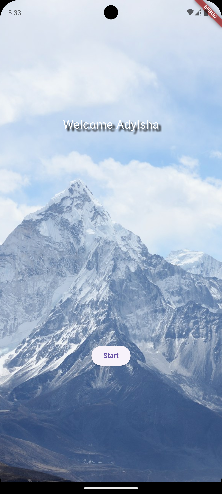
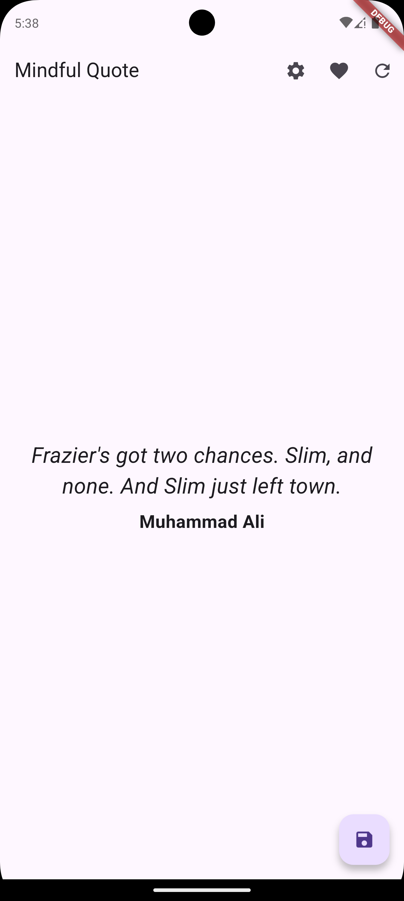
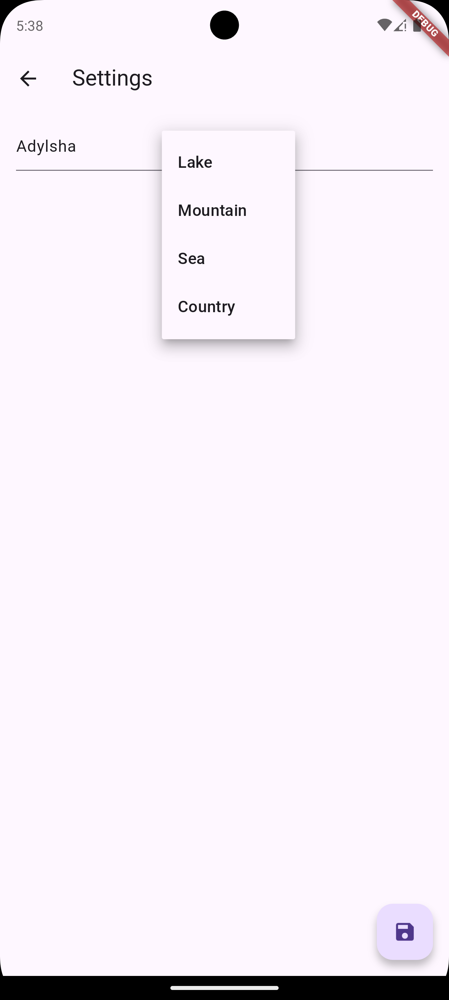

# Mindful App

An application developed to grasp the basics of Flutter.

## Features

1- Fetches famous quotations by connecting to the Web API.

2- SharedPreferences stores the settings saved by users and provides a customised experience.

3- Creates a local database with Sembast, allowing the user to save the quotes they like and then delete them if they want.

## Images From App

### Intro Screen

### Quotes Screen

### Settings Screen

### Favorites Screen

